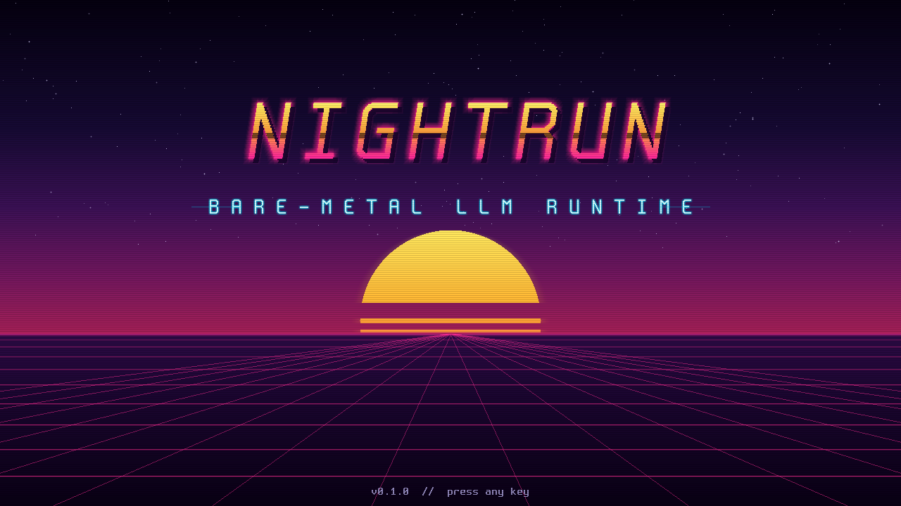
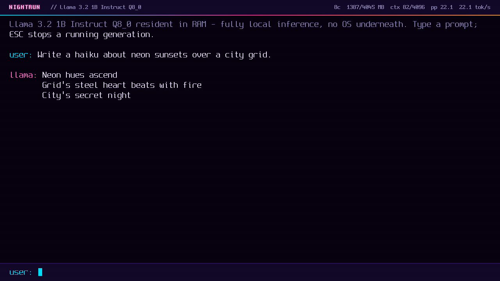

# NightRun

**A bare-metal x86_64 LLM appliance.** NightRun boots straight from a USB
stick into a synthwave chat terminal and runs **Llama 3.2 1B Instruct**
entirely on the CPU — no Linux, no GRUB, no operating system underneath.
Everything on screen (boot splash, loading sequence, chat UI, inference,
tokenizer) is our own Rust code running as a single UEFI application.




## What it does

1. Boot an x86_64 machine from USB.
2. NightRun brings up the framebuffer, enables AVX2, and starts every CPU
   core as an inference worker.
3. The model (~1.26 GB, Q8_0) is loaded **fully into RAM** and CRC-verified.
4. You get a `user:` / `llama:` chat with live tokens/sec — fully offline.

Measured in QEMU (8 cores, KVM): **~22 tok/s generation, ~23 tok/s prompt
processing**, chat-ready in ~9 s after the splash. See
[docs/benchmarks.md](docs/benchmarks.md).

## Hardware requirements

- x86_64 machine with **UEFI** firmware (USB boot enabled, Secure Boot off)
- **8 GB RAM recommended** (4 GB minimum)
- AVX2-capable CPU strongly recommended (Intel Haswell+/AMD Zen+; scalar
  fallback exists but is slow)
- USB keyboard, any GOP-capable display

## Build

Requirements: Linux host, Rust (stable for host tools, **nightly with
rust-src** for the UEFI binary), QEMU + OVMF for emulation.

```sh
rustup toolchain install nightly --component rust-src
cargo xtask build          # builds BOOTX64.EFI (custom hard-float UEFI target)
cargo test                 # host test suite (kernels, tokenizer, parity)
```

## Get and convert the model

NightRun runs Llama 3.2 1B Instruct in **Q8_0** GGUF form, converted to its
own `.nrm` runtime format. Llama 3.2 is distributed under the
[Llama 3.2 Community License](https://huggingface.co/meta-llama/Llama-3.2-1B-Instruct)
— review and accept it. A ready-made Q8_0 GGUF (e.g.
`bartowski/Llama-3.2-1B-Instruct-GGUF`) works directly:

```sh
mkdir -p models
curl -L -o models/Llama-3.2-1B-Instruct-Q8_0.gguf \
  https://huggingface.co/bartowski/Llama-3.2-1B-Instruct-GGUF/resolve/main/Llama-3.2-1B-Instruct-Q8_0.gguf
cargo run --release -p nrconvert -- \
  models/Llama-3.2-1B-Instruct-Q8_0.gguf models/model.nrm
```

The converter validates its own output (parses it back, re-checksums, and
smoke-tests the tokenizer).

## Build the bootable image and run it

```sh
cargo xtask image                     # -> nightrun.img (GPT + FAT32 ESP)
cargo xtask run --img --mem 4G --window   # boot it in QEMU + OVMF
```

Useful `cargo xtask run` flags: `--window` (show display), `--mem`, `--smp`,
`--secs N` (auto-quit), `--shot t:file.png` (screendump), `--keys t:text`
(scripted typing). `cargo xtask bench` runs a scripted benchmark boot and
writes `docs/benchmarks.md`.

## Write it to a USB stick

```sh
sudo dd if=nightrun.img of=/dev/sdX bs=4M status=progress oflag=direct
sync
```

(`/dev/sdX` = your USB stick — double-check with `lsblk`; this destroys its
contents.) Then boot the target machine from USB (F12/F10/Esc boot menu,
UEFI mode, Secure Boot disabled).

In the chat: type and press Enter; **ESC** stops a running generation.
Serial console (COM1 115200) carries debug logs.

## How it works

Single `no_std` Rust UEFI application, structured as a boot layer (GOP
framebuffer, AVX enable via `XSETBV`, chunked model load off the boot
volume, multi-core bring-up via `EFI_MP_SERVICES_PROTOCOL`) and a runtime
(arena memory, own font/graphics stack, byte-level BPE tokenizer, Q8_0
AVX2 inference engine with f16 KV cache). Greedy output is verified
token-for-token against llama.cpp. Details in
[docs/architecture.md](docs/architecture.md).

```
crates/nr-boot      UEFI entry, video, input, model load, SMP, app shell
crates/nr-gfx       framebuffer surface, PSF fonts, drawing, theme
crates/nr-ui        splash / loading / chat screens
crates/nr-runtime   arena allocator, TSC clock
crates/nr-tensor    Q8_0 + f16 kernels (AVX2/FMA/F16C), worker pool
crates/nr-token     BPE tokenizer, Llama-3 pretokenizer + chat template
crates/nr-model     .nrm format, llama forward pass, sampling
tools/nrconvert     GGUF -> .nrm converter
tools/nrhost        host CLI running the same engine (debug/bench)
tools/xtask         build / image / run / bench automation
```

## License

Code: MIT. Fonts: [Spleen](https://github.com/fcambus/spleen) (BSD 2-Clause,
see `assets/fonts/SPLEEN-LICENSE`). Model weights are **not** included and
are covered by the Llama 3.2 Community License.
